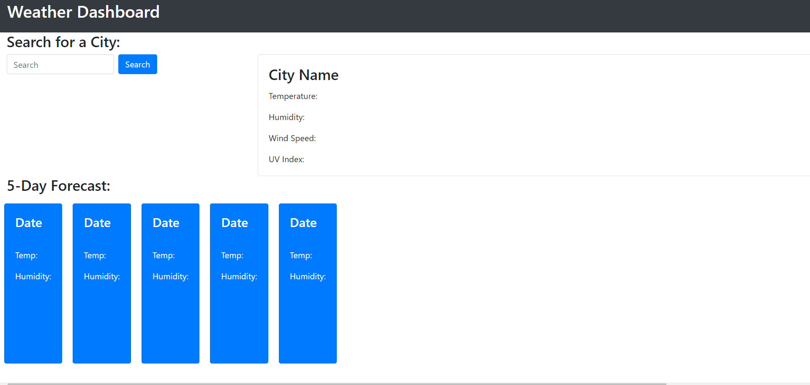

# Jack-s-Weather-Dashboard

## Purpose of this Project
The purpose of this project was to build a weather dashboard where the user can search for any city and have the current weather data as well as data for the next five days.
## Goals of this Project
- Use jQuery AJAX queries to grab appropriate data from OpenWeatherMap APIs depending on city searched;
- Use JavaScript to update the DOM with the data retrieved from OpenWeatherMap APIs through AJAX queries;
- Use local storage to store the searched city name & retrieve the previously searched city names when reloading the webpage to update to the DOM.
## Problems encountered in this Project
The major problem encountered was after the restructuring of the AJAX queries from inside of the search button's "click" eventListener to independent functions. After doing this the UVIndex AJAX query function stopped working. Took a while to determine that this was due to the UVIndex function, due to it being inside of another function, I had to call the UVIndex function inside of this other function in order for it to work.

## Screenshots of Completed Project
###### Weather Dashboard prior to any interaction

###### Weather Dashboard after searching for "Mandurah", showing how the data has been updated to the DOM

###### Showing that the searched city is saved to local storage in an array

###### Showing that the searchedCityArray is then used to display what cities were searched for previously (after reload of page)

## Links to GitHub Repository & Live Project
### https://github.com/Foggles/Jack-s-Weather-Dashboard
### https://foggles.github.io/Jack-s-Weather-Dashboard/